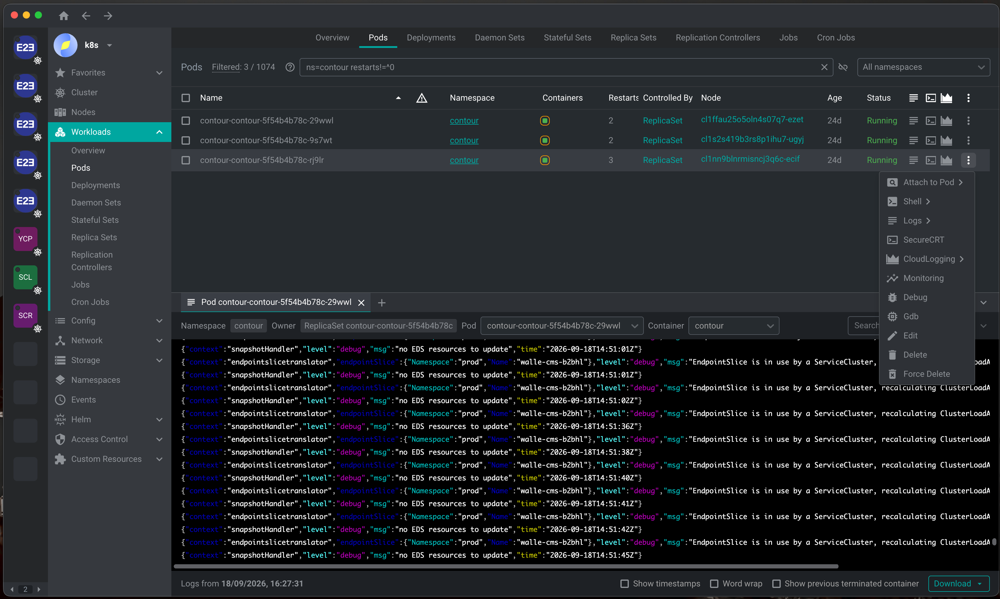

# freelens-logscolor (Freelens 1.x, Lens 6.x)

Раскраска логов в **штатном** просмотрщике Freelens — том самом, который открывает кнопка
Logs у пода. Ничего больше расширение не делает: ни пунктов меню, ни колонок, ни своих
панелей.

> Это ветка под Freelens 1.x и Lens 6.x. Под Freelens 2.x — ветка [`v2`](../../tree/v2),
> общее описание и схема веток — в [`main`](../../tree/main).



## Что красится

| Формат | Как |
|---|---|
| JSON | ключ — цветом по своему имени (см. ниже), строковые значения цветом темы, числа жёлтым, `true`/`false`/`null` сиреневым, скобки и запятые тускло |
| `level` / `lvl` / `severity` | значение по уровню: ERROR красным, WARN жёлтым, INFO зелёным, DEBUG сиреневым, FATAL ярко-красным |
| logfmt (`key=value`) | так же, по ключам и типам значений |
| klog (`I0918 13:00:33.350123 1 controller.go:42]`) | буква уровня цветом, остальная шапка тускло |
| `panic:`, `fatal error:`, `Traceback` | строка целиком красным |
| стектрейсы (`at …`, `Caused by:`, `… 12 more`, `goroutine N [running]:`, `File "x", line N`) | тускло |
| всё остальное | уровень словом, если он узнаётся; остальное без изменений |

### Цвет ключа по его имени

Цвет ключа не один на всех: он считается из самого имени (FNV-1a по символам), поэтому `pod`
всегда одного цвета, `trace_id` — другого, и нужное поле ловится глазом, не читая строку. Цвет
один и тот же в JSON и в logfmt: считается от имени, а не от формата.

В палитре десять цветов из шестнадцати базовых, остальные исключены осознанно: красный занят
ошибками (ключ такого цвета читался бы как авария), серым тушатся стектрейсы, а чёрный и белый
пропадают в тёмной и светлой теме. Строковые значения не красятся вовсе — их в строке больше
всего, и когда цветное всё подряд, не выделяется уже ничего.

Менять — в одном месте, `KEY_PALETTE` в [src/colorize.ts](src/colorize.ts).

### Тусклое здесь серое, а не faint

Freelens 1.x показывает логи через AnsiUp 5, а тот не знает кода `2` (faint) и молча его
выбрасывает. Поэтому всё «фоновое» — скобки и запятые JSON, таймстемпы, стектрейсы, шапка
klog — покрашено серым `0;90`, а не приглушено. В ветке `v2` на этом месте настоящий faint:
AnsiUp 6 его понимает. Это единственное место, где код веток расходится, и вынесено оно в одну
константу `FAINT`.

## Текст строки не меняется

Добавляются только escape-коды. Это не обещание в комментарии, а проверяемое свойство: тесты
снимают ANSI с каждого образца и сравнивают с исходником посимвольно. Поэтому кавычки не
доэкранируются, битый JSON не роняет строку, а строка длиннее 64 КБ отдаётся вообще без
разбора. Отдельно охраняется таймстемп kubernetes в начале строки: по нему вьювер считает
`sinceTime` для дозагрузки, так что до него не доходит ни один escape-код.

## Установка

```sh
git clone https://github.com/Dees7/freelens-logscolor.git
cd freelens-logscolor
git switch v1
npm install && npm run build
mkdir -p ~/.freelens/extensions
ln -s "$PWD" ~/.freelens/extensions/freelens-logscolor
```

В Lens 6.x каталог расширений тот же по смыслу, но свой: `~/.k8slens/extensions`.

Дальше — Cmd+R в окне приложения. В devtools появится
`[logscolor] раскраска логов подключена`.

Собранный `.tgz` (`npm run pack`) ставится обычным способом, через Extensions в приложении.

## Настройка

Её почти нет: расширение включено по умолчанию, потому что ровно для этого и ставится.
Выключить, не удаляя, — файлом `~/.freelens/freelens-logscolor.json` (или `~/.k8slens/…`, если
работаете в Lens):

```json
{ "enabled": false }
```

Правка действует сразу, перезапускать окно не нужно. Своей панели в настройках приложения у
расширения нет намеренно: она потребовала бы React от хоста, а без неё расширению хватает
одного `Renderer` с `global.LensExtensions` — того, что любой Freelens 1.x и Lens 6.x кладут
туда сами.

## Чем приходится платить

Точки расширения для логов в API Freelens нет, поэтому расширение оборачивает метод `getLogs`
у того же экземпляра `PodApi`, через который вьювер и читает логи
([src/log-colors.ts](src/log-colors.ts)). Отсюда:

- экземпляр общий, поэтому раскрашенным станет и «Download all logs» — в файл попадут
  escape-коды;
- поиск по логам идёт по строке с кодами, поэтому совпадение, попавшее на границу цвета
  (например `"msg"` вместе с кавычками), может не подсветиться;
- если апстрим переименует метод, обёртка просто не поставится и скажет об этом в devtools.

## Разработка

```sh
npm run check    # типы + тесты + сборка + smoke
npm test         # только тесты (17 проверок, все — на инвариант «текст не изменился»)
npm run smoke    # собранный бандл грузится так же, как его грузит хост, и красит ответ
npm start        # пересборка на каждое изменение
```

`dist/` в git не лежит, а форматы сборки у веток разные: здесь CommonJS, в `v2` — ESM.
После `git switch` в рабочем каталоге остаётся бандл прошлой ветки, и приложение молча не
загрузит расширение — `require()` спотыкается об `import` на первой строке, до всякой
активации. Поэтому после переключения веток всегда `npm install && npm run build`, а потом
Cmd+R. `npm run smoke` ловит ровно этот случай.

Типы `@freelensapp/extensions` 1.10.3 берутся с npm, но их приходится доставать вручную: сам
пакет — семь строк реэкспорта из `@freelensapp/core`, а тот не объявляет `types` в `exports`.
Без `paths` в [tsconfig.json](tsconfig.json) TS отдал бы `any` на весь API и проверка типов
перестала бы что-либо проверять.

Правки самой раскраски живут в [src/colorize.ts](src/colorize.ts) — файл без единого импорта,
чистые строковые функции. Он общий с веткой `v2` (кроме одной константы `FAINT`), так что
переносить изменения между ветками нужно черри-пиком, а не слиянием.

## Лицензия

BSD 3-Clause, см. [LICENSE](LICENSE).
